# 🏗️ AI Terraform Agent - System Architecture

Complete architecture overview of the AI-powered infrastructure generation system.

## 🎯 **High-Level Architecture Overview**

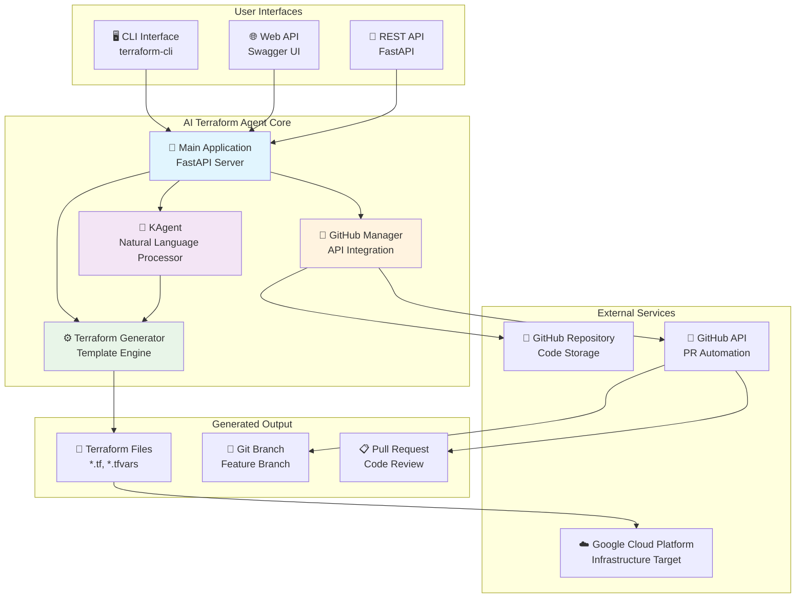

## 🔄 **Request Flow Architecture**

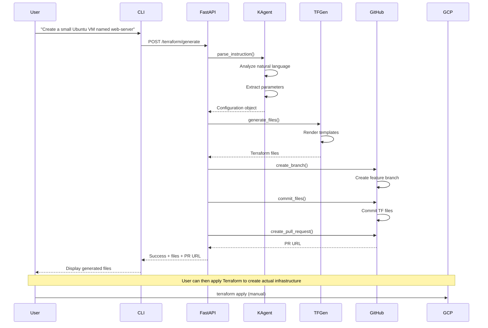

## 🧠 **AI Processing Architecture**

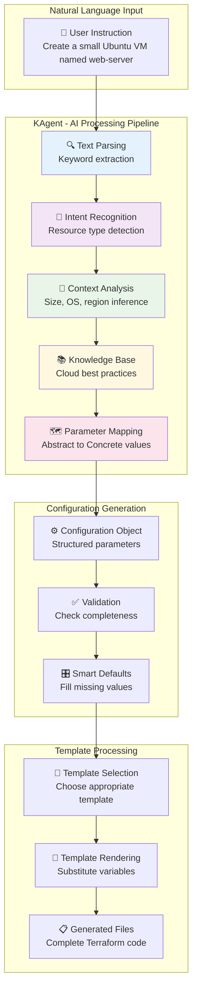

## 🗂️ **Data Flow Architecture**

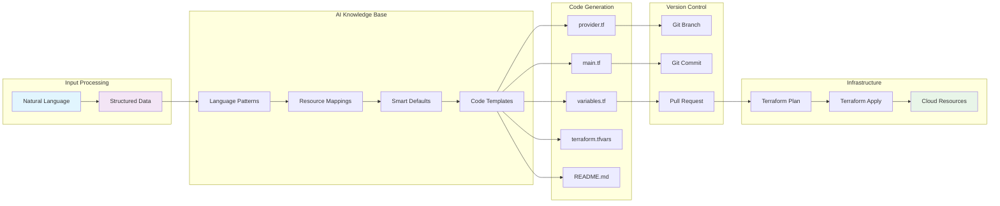

## 🐳 **Deployment Architecture**

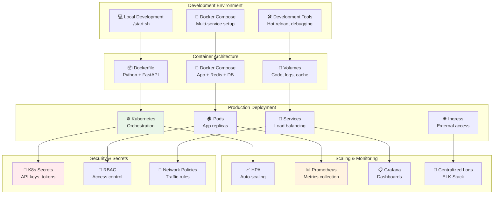

## 🌐 **Network Architecture**

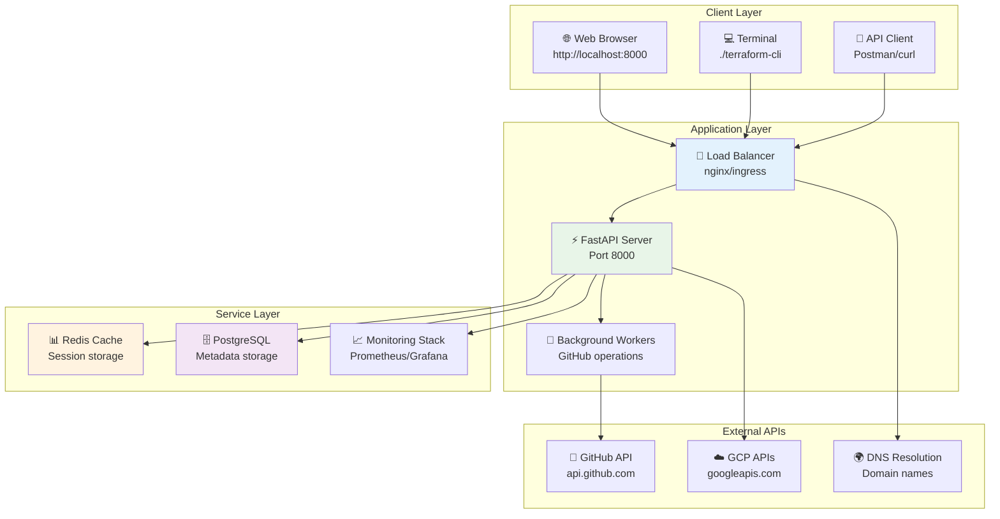

## 📊 **Component Architecture**

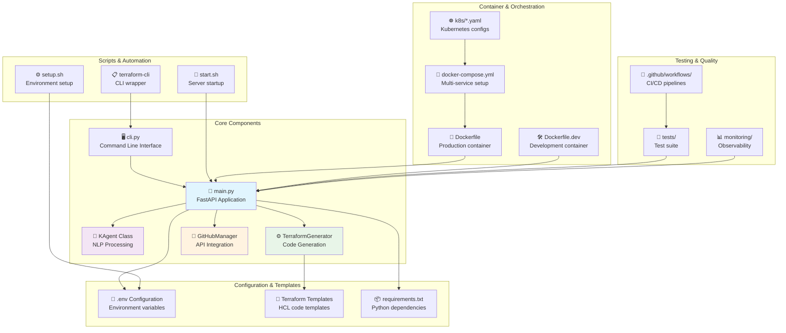

## 🔄 **CI/CD Pipeline Architecture**

```mermaid
graph LR
    subgraph "Source Control"
        COMMIT[📝 Git Commit<br/>Code changes]
        PUSH[⬆️ Git Push<br/>Trigger pipeline]
        PR[📋 Pull Request<br/>Code review]
    end
    
    subgraph "Continuous Integration"
        TRIGGER[🎯 GitHub Actions<br/>Workflow trigger]
        LINT[✨ Code Linting<br/>Black, flake8]
        TEST[🧪 Run Tests<br/>pytest, coverage]
        VALIDATE[✅ TF Validation<br/>terraform validate]
    end
    
    subgraph "Security & Quality"
        SECURITY[🔒 Security Scan<br/>Bandit, safety]
        SECRETS[🕵️ Secret Detection<br/>TruffleHog]
        VULN[🛡️ Vulnerability Scan<br/>Trivy, Snyk]
    end
    
    subgraph "Build & Package"
        BUILD[🏗️ Docker Build<br/>Multi-stage build]
        PUSH_IMG[📦 Push Image<br/>GitHub Registry]
        TAG[🏷️ Version Tag<br/>Semantic versioning]
    end
    
    subgraph "Deployment"
        STAGING[🎪 Deploy Staging<br/>K8s staging env]
        HEALTH[❤️ Health Check<br/>Readiness probe]
        PROD[🚀 Deploy Production<br/>Blue-green deploy]
    end
    
    COMMIT --> PUSH
    PUSH --> PR
    PR --> TRIGGER
    
    TRIGGER --> LINT
    LINT --> TEST
    TEST --> VALIDATE
    
    VALIDATE --> SECURITY
    SECURITY --> SECRETS
    SECRETS --> VULN
    
    VULN --> BUILD
    BUILD --> PUSH_IMG
    PUSH_IMG --> TAG
    
    TAG --> STAGING
    STAGING --> HEALTH
    HEALTH --> PROD
    
    style TRIGGER fill:#e3f2fd
    style TEST fill:#e8f5e8
    style SECURITY fill:#ffebee
    style BUILD fill:#fff3e0
    style PROD fill:#e8f5e8
```

## 🏢 **Enterprise Architecture (Future)**

```mermaid
graph TB
    subgraph "Multi-Cloud Support"
        AWS[☁️ Amazon Web Services<br/>EC2, S3, VPC]
        AZURE[☁️ Microsoft Azure<br/>VMs, Storage, VNet]
        GCP[☁️ Google Cloud Platform<br/>Compute, Storage, VPC]
    end
    
    subgraph "Enhanced AI Layer"
        GPT[🤖 GPT Integration<br/>Advanced NLP]
        CLAUDE[🧠 Claude Integration<br/>Complex reasoning]
        CUSTOM_ML[🎯 Custom ML Models<br/>Domain-specific training]
    end
    
    subgraph "Enterprise Features"
        SSO[🔐 Single Sign-On<br/>SAML, OAuth]
        RBAC_ENT[👥 Enterprise RBAC<br/>Team permissions]
        AUDIT[📋 Audit Logging<br/>Compliance tracking]
        POLICY[📜 Policy Engine<br/>Governance rules]
    end
    
    subgraph "Advanced Integrations"
        SLACK[💬 Slack Bot<br/>ChatOps interface]
        JIRA[🎫 Jira Integration<br/>Ticket automation]
        SERVICENOW[🎭 ServiceNow<br/>ITSM integration]
        TERRAFORM_CLOUD[☁️ Terraform Cloud<br/>State management]
    end
    
    subgraph "Observability & Analytics"
        DATADOG[📊 DataDog<br/>APM monitoring]
        SPLUNK[📈 Splunk<br/>Log analytics]
        COST_OPTIMIZATION[💰 Cost Analytics<br/>FinOps insights]
        USAGE_ANALYTICS[📊 Usage Analytics<br/>User behavior]
    end
    
    AWS --> CUSTOM_ML
    AZURE --> GPT
    GCP --> CLAUDE
    
    SSO --> RBAC_ENT
    RBAC_ENT --> AUDIT
    AUDIT --> POLICY
    
    SLACK --> JIRA
    JIRA --> SERVICENOW
    SERVICENOW --> TERRAFORM_CLOUD
    
    DATADOG --> SPLUNK
    SPLUNK --> COST_OPTIMIZATION
    COST_OPTIMIZATION --> USAGE_ANALYTICS
    
    style AWS fill:#ff9800
    style AZURE fill:#2196f3
    style GCP fill:#4caf50
    style GPT fill:#9c27b0
    style CLAUDE fill:#e91e63
```

## 📈 **Scaling Architecture**

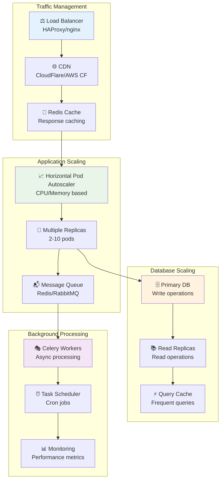

## 🔍 **Monitoring & Observability Architecture**

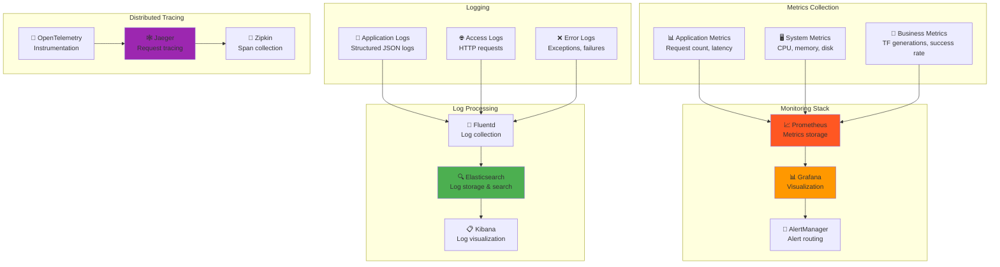

---

## 📋 **Architecture Summary**

### **Current Implementation**
- ✅ **Monolithic FastAPI application** with modular components
- ✅ **Rule-based AI** for natural language processing
- ✅ **Template-based code generation** for Terraform files
- ✅ **GitHub API integration** for automated PRs
- ✅ **Docker containerization** for consistent deployment
- ✅ **CLI and web interfaces** for multiple access methods

### **Production Ready Features**
- ✅ **Kubernetes deployment** with auto-scaling
- ✅ **Monitoring and observability** with Prometheus/Grafana
- ✅ **Security scanning** in CI/CD pipeline
- ✅ **Multi-environment support** (dev/staging/prod)
- ✅ **Health checks and graceful shutdown**

### **Future Enhancements**
- 🔄 **Multi-cloud support** (AWS, Azure)
- 🔄 **Advanced AI integration** (GPT, Claude)
- 🔄 **Enterprise features** (SSO, RBAC, audit)
- 🔄 **Enhanced integrations** (Slack, Jira, ServiceNow)
- 🔄 **Cost optimization** and usage analytics

This architecture provides a solid foundation for scaling from a simple development tool to an enterprise-grade infrastructure automation platform. 🚀
